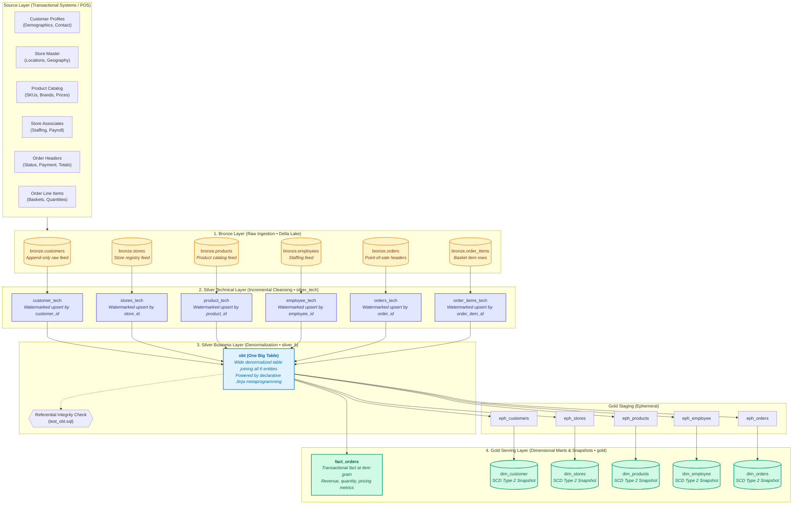

# Walmart Lakehouse Data Platform 🛒📊

[](https://www.getdbt.com/)
[](https://databricks.com/)
[](https://www.databricks.com/glossary/medallion-architecture)
[](#-detailed-layer-breakdown--engineering-decisions)
[](#-security--credential-management)

An enterprise-grade **Medallion Lakehouse** data platform built with **dbt** and **Databricks Delta Lake**. This project transforms raw point-of-sale (POS) and retail enterprise data into high-performance, analytics-ready analytical marts and slowly changing dimensions (SCD Type 2).

---

## 📌 Executive Summary & Business Context

In large-scale omnichannel retail, transactions occur across thousands of stores and digital channels simultaneously. To deliver accurate operational reporting, inventory intelligence, and customer insights, data engineering teams face three primary challenges:

1. **Transaction Granularity vs. Analytical Performance**: Point-of-sale databases store orders and items across separate normalized relational tables. Querying raw normalized schemas directly in business intelligence (BI) tools causes massive join overhead, slow dashboard load times, and high cloud compute bills.
2. **Historical State Drift (The SCD Problem)**: Over time, customer addresses change, employees are promoted or reassigned, store attributes update, and product prices fluctuate. If updates simply overwrite existing rows (SCD Type 1), historical revenue analysis and point-in-time order attribution become distorted (e.g., reporting a sale made in 2023 with a 2025 price or a customer's new address).
3. **Data Freshness vs. Compute Cost**: Scanning hundreds of gigabytes of historical data on every run is unsustainable. The pipeline must ingest new and updated records incrementally using high-watermark tracking while maintaining deduplication and referential integrity.

### What This Platform Delivers
- **Incremental Technical Ingestion**: Watermark-driven incremental tables in `silver_tech` that process only newly created or modified records.
- **Unified Analytical Substrate (One Big Table - OBT)**: A consolidated, denormalized wide table combining 6 retail entity domains into a single source of truth, eliminating repetitive multi-table joins for downstream analysts.
- **Dynamic Jinja Metaprogramming**: A declarative configuration pattern that dynamically builds wide joins and schema projections, replacing fragile, error-prone manual SQL.
- **Audit-Proof Historical Tracking (SCD Type 2)**: Automated snapshot models in `gold` that record attribute histories with precise validity windows (`dbt_valid_from` to `dbt_valid_to`), setting active records to `9999-12-31`.
- **Granular Fact Tables**: Transactional order-item grain marts powering KPIs like Average Order Value (AOV), basket size, store efficiency, and category margins.

---

## 🏛️ Lakehouse Architecture & Data Flow

The platform implements the industry-standard **Medallion Lakehouse Architecture**, moving data from raw capture to business-ready dimensional structures:



---

## 🔍 Detailed Layer Breakdown & Engineering Decisions

### 1. Bronze Layer (`walmart.bronze`)
- **Role**: Raw landing zone for raw operational tables ingested from source relational stores into Databricks Delta Lake.
- **Design Philosophy**: Unaltered schema fidelity. Data is captured with historical integrity to allow complete pipeline replays and audits.
- **Catalog Declaration**: Managed via [`source.yml`](file:///c:/Users/krish/Documents/Code/Walmart_database/walmart_db/models/source/source.yml).

| Source Table | Entity Domain | Primary Key | Business Role |
| :--- | :--- | :--- | :--- |
| `customers` | Customer Management | `customer_id` | Master identity, email, phone, city, province, and active status |
| `stores` | Retail Real Estate | `store_id` | Brick-and-mortar physical locations, municipal jurisdictions |
| `products` | Merchandising & Inventory | `product_id` | Catalog SKU details, category hierarchy, brand, and retail price |
| `employees` | Workforce Operations | `employee_id` | Store associate registry, job title, and base compensation |
| `orders` | Sales & Transactions | `order_id` | Checkout events, timestamp, payment method, order status, total cost |
| `order_items` | Basket Analytics | `order_item_id` | Individual product items purchased per order, quantity, unit price |

---

### 2. Silver Technical Layer (`walmart.silver_tech`)
- **Role**: Technical standardization, deduplication, incremental upserting, and audit logging.
- **Engineering Highlights**:
  - **Delta MERGE Incremental Materialization**: Uses dbt's `incremental` materialization with a defined `unique_key`. When new records arrive, modified rows are merged and new rows are inserted without scanning unchanged data.
  - **High-Watermark Filtering**: Compares incoming `updated_timestamp` against the current maximum `updated_timestamp` in the target table:
    ```sql
    
        WHERE updated_timestamp > (SELECT COALESCE(MAX(updated_timestamp), '1900-01-01') FROM {{ this }})
    
    ```
  - **Technical Lineage**: Appends `current_timestamp() AS processed_at` to provide visibility into when each row entered the lakehouse.
  - **Automated Data Quality Testing**:
    - `orders_tech`: Primary key uniqueness and non-null assertions.
    - `product_tech`: Uniqueness validation on active products with price sanity assertions (`where: "price > 0"`).

---

### 3. Silver Business Layer: One Big Table (`walmart.silver_b`)
- **Role**: Denormalized analytics foundation that unifies all 6 entity domains.
- **Model**: [`models/silver_b/obt.sql`](file:///c:/Users/krish/Documents/Code/Walmart_database/walmart_db/models/silver_b/obt.sql)

#### Why One Big Table (OBT)?
In analytical reporting and ad-hoc SQL querying, performing 6-way `JOIN` operations repeatedly leads to:
1. **High Query Latency**: End-user dashboards in Power BI or Tableau re-execute expensive shuffle operations on every filter change.
2. **Semantic Divergence**: Different analysts write joins with slight variations (e.g., inner join vs. left join, missing conditions), yielding conflicting numbers for revenue or order counts.
3. **Resource Waste**: Cloud warehouse compute credits are wasted recalculating identical join paths.

By pre-computing the **One Big Table**, queries on orders, items, products, customers, employees, and stores hit a single pre-joined table.

#### Dynamic Jinja Meta-Programming
Instead of hardcoding 140 lines of static SQL `LEFT JOIN` statements, `obt.sql` uses a declarative configuration array:
- Each joined entity is specified as a dictionary containing its reference, alias, join key, and selected columns.
- Jinja iteratively unpacks the column list and builds the `LEFT JOIN` clauses automatically.
- Adding a new attribute or table in the future requires editing only the config block, preventing regression bugs.

#### Data Integrity Gate
To ensure the denormalization never produces orphan rows or join fan-out, the custom test [`test_obt.sql`](file:///c:/Users/krish/Documents/Code/Walmart_database/walmart_db/tests/test_obt.sql) asserts referential integrity across all foreign keys:
```sql
SELECT 1 FROM {{ ref('obt') }} AS obt_b
WHERE obt_b.order_id IS NULL
   OR obt_b.product_id IS NULL
   OR obt_b.store_id IS NULL
   OR obt_b.employee_id IS NULL
   OR obt_b.customer_id IS NULL
   OR obt_b.order_item_id IS NULL;
```

---

### 4. Gold Serving Layer (`walmart.gold`)
- **Role**: Kimball-style star schema models optimized for business intelligence, executive metrics, and audit history.

#### Transactional Fact: `fact_orders`
- **Granularity**: One row per item inside a customer order (`order_item_id`).
- **Measures**: `quantity`, `unit_price`, `line_amount`, `total_amount`.
- **Dimensions**: Foreign keys linking to `order_id`, `product_id`, `store_id`, `employee_id`, and `customer_id`.

#### Slowly Changing Dimensions (SCD Type 2) Snapshots
Retail attributes are fluid:
- A customer moves from Toronto to Vancouver.
- An employee is promoted from Cashier to Department Lead.
- A product's retail price is marked down from $49.99 to $39.99.

If these updates overwrite past values, historical reporting breaks. For example, calculating last month's profit margin using today's discounted price produces false margins.

The platform uses dbt snapshots configured in [`snapshots/*.yml`](file:///c:/Users/krish/Documents/Code/Walmart_database/walmart_db/snapshots/) to preserve full historical lineage:
- **Change Detection**: Strategy `timestamp` tracks mutations via each entity's `updated_timestamp`.
- **Current Record Identification**: Configured with `dbt_valid_to_current: "to_date('9999-12-31')"`. This standard allows analysts to filter for current rows with simple boolean logic (`WHERE dbt_valid_to = '9999-12-31'`) or perform point-in-time historical joins.

```sql
-- Point-in-time join example: attributing revenue to customer's city at order time
SELECT 
    f.order_id,
    f.line_amount,
    c.customer_city,
    p.product_name,
    p.price AS price_at_sale_date
FROM walmart.gold.fact_orders f
JOIN walmart.gold.dim_customer c
  ON f.customer_id = c.customer_id
 AND f.order_timestamp >= c.dbt_valid_from
 AND f.order_timestamp < c.dbt_valid_to
JOIN walmart.gold.dim_products p
  ON f.product_id = p.product_id
 AND f.order_timestamp >= p.dbt_valid_from
 AND f.order_timestamp < p.dbt_valid_to;
```

---

## 📊 Business Metrics & Analytical Use Cases

With this platform deployed, analytics and BI teams can answer high-impact commercial questions:

1. **Basket Analysis & Product Affinity**:
   - What are the top product pairings purchased together?
   - What is the average basket size across physical store categories?
2. **Omnichannel Store Performance**:
   - Which retail locations achieve the highest sales revenue per square foot?
   - How does associate staffing correlate with store sales throughput?
3. **Customer Cohort Retention & Churn**:
   - How does customer relocation between provinces impact recurring order frequency?
   - What is the Customer Lifetime Value (CLV) grouped by acquisition cohort?
4. **Margin & Pricing Audit**:
   - Track product price velocity and examine how historical discounts influenced overall order volumes.

---

## 📁 Repository Structure

```text
Walmart_database/
├── .gitignore                   # Multi-tier security & build ignore rules
├── README.md                    # Platform engineering documentation
├── Walmart_dataset/             # Raw source assets & DDL definitions
│   ├── .env.example             # Clean environment template (URI & API keys)
│   ├── data/                    # Source CSV data extracts
│   │   ├── customers.csv        # Customer profiles
│   │   ├── employees.csv        # Associate records
│   │   ├── order_items.csv      # Order line items
│   │   ├── orders.csv           # Transaction headers
│   │   ├── products.csv         # Product catalog
│   │   └── stores.csv           # Store directory
│   └── ddl/
│       └── walmart_schema.sql   # Relational schema DDL
└── walmart_db/                  # Core dbt transformation project
    ├── .gitignore               # dbt package ignore rules
    ├── dbt_project.yml          # Project configuration & schema settings
    ├── profiles.sample.yml      # Zero-credential Databricks connection template
    ├── README.md                # dbt operations reference
    ├── macros/
    │   └── custom_schema.sql    # Custom schema router macro
    ├── models/
    │   ├── source/
    │   │   └── source.yml       # Bronze source declarations
    │   ├── silver_tech/         # Incremental watermarked technical models
    │   │   ├── customer_tech.sql
    │   │   ├── employee_tech.sql
    │   │   ├── order_items_tech.sql
    │   │   ├── orders_tech.sql
    │   │   ├── product_tech.sql
    │   │   ├── stores_tech.sql
    │   │   └── propeties.yml    # Data tests & constraints
    │   ├── silver_b/
    │   │   └── obt.sql          # Dynamic Jinja One Big Table (OBT)
    │   └── gold/
    │       ├── ephemeral/       # Ephemeral staging queries for snapshots
    │       │   ├── eph_customers.sql
    │       │   ├── eph_employee.sql
    │       │   ├── eph_orders.sql
    │       │   ├── eph_products.sql
    │       │   └── eph_stores.sql
    │       └── fact/
    │           └── fact_orders.sql # Core transactional fact table
    ├── snapshots/               # SCD Type 2 YAML snapshot definitions
    │   ├── dim_customer.yml
    │   ├── dim_employee.yml
    │   ├── dim_orders.yml
    │   ├── dim_products.yml
    │   └── dim_stores.yml
    └── tests/
        └── test_obt.sql         # Referential integrity test
```

---

## 🔒 Security & Credential Management

This project strictly enforces a **Zero-Credential Policy**:
- **Ignored Files**: All files containing sensitive Databricks tokens (`profiles.yml`), database connection URIs (`.env`), dbt runtime state (`.user.yml`), and logs (`logs/`, `*.log`) are ignored by Git.
- **Environment Variable Injection**: In automated CI/CD pipelines (GitHub Actions, GitLab CI) and local development, credentials should be injected via environment variables:
  ```bash
  export DBT_DATABRICKS_HOST="dbc-xxxx.cloud.databricks.com"
  export DBT_DATABRICKS_HTTP_PATH="/sql/1.0/warehouses/xxxx"
  export DBT_DATABRICKS_TOKEN="dapi_your_access_token_here"
  ```
- **Templates**: Always configure local instances using [`walmart_db/profiles.sample.yml`](file:///c:/Users/krish/Documents/Code/Walmart_database/walmart_db/profiles.sample.yml) and [`Walmart_dataset/.env.example`](file:///c:/Users/krish/Documents/Code/Walmart_database/Walmart_dataset/.env.example).

---

## 🚀 Operations & Execution Guide

### 1. Prerequisites
- Python 3.10+
- dbt-databricks adapter 1.8+
- Active Databricks SQL Warehouse or Unity Catalog compute cluster

### 2. Environment Setup
```bash
# Clone the repository
git clone <repository_url>
cd Walmart_database

# Create and activate virtual environment
python -m venv .venv
# On Windows:
.venv\Scripts\activate
# On Linux / macOS:
source .venv/bin/activate

# Install dbt-databricks
pip install dbt-databricks
```

### 3. Connection Configuration
```bash
# Copy sample profile
cp walmart_db/profiles.sample.yml walmart_db/profiles.yml

# Navigate into dbt project
cd walmart_db

# Validate connection to Databricks
dbt debug
```

### 4. Running the Pipeline

```bash
# Step 1: Ingest and merge the incremental technical layer (Silver Tech)
dbt run --select silver_tech

# Step 2: Build the One Big Table (OBT) and downstream gold models
dbt run --select obt+

# Step 3: Execute SCD Type 2 snapshots to capture historical changes
dbt snapshot

# Step 4: Run all data quality and referential integrity tests
dbt test

# Step 5: Full end-to-end production build (models + snapshots + tests)
dbt build

# Optional: Perform a full-refresh rebuild of incremental models
dbt run --select silver_tech --full-refresh
```

---

## 🛡️ Data Governance & Quality Standards

- **Primary Key Integrity**: Every entity has a unique identifier verified with dbt tests (`unique`, `not_null`).
- **Domain Constraints**: Business values are guarded with conditional filters (e.g. `where: "price > 0"`).
- **Referential Integrity**: Multi-table relationships are asserted in `test_obt.sql` before metrics hit the Gold layer.
- **Audit Lineage**: Every row records its processing timestamp (`processed_at`), and dimensional snapshots preserve historical windows (`dbt_valid_from`, `dbt_valid_to`).

---

## 👥 Contributors & Maintainers
Engineered for enterprise data platform analytics. Maintained by the Walmart Data Engineering Team.
