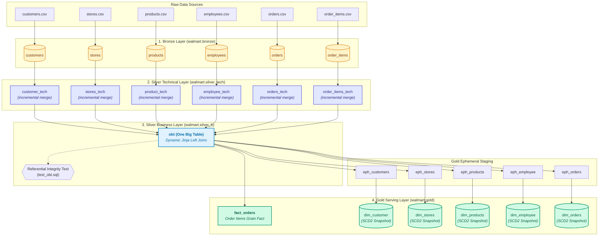

# Walmart Lakehouse Data Platform 🛒⚡

[](https://www.getdbt.com/)
[](https://databricks.com/)
[-0071DC?style=for-the-badge)](https://www.databricks.com/glossary/medallion-architecture)
[](file:///.gitignore)

An enterprise-grade **Medallion Lakehouse** data transformation platform engineered with **dbt** and **Databricks Delta Lake**. The platform ingests omnichannel retail data (customers, orders, order items, products, stores, and employees) through incremental watermarking, compiles a dynamic Jinja-driven **One Big Table (OBT)**, and delivers dimensional models with **Slowly Changing Dimensions (SCD Type 2)** alongside transactional fact tables.

---

## 🌟 Interactive Documentation & Architecture Viewer

This repository features an interactive web documentation dashboard: **[`interactive_readme.html`](file:///c:/Users/krish/Documents/Code/Walmart_database/interactive_readme.html)**.

Open **[`interactive_readme.html`](file:///c:/Users/krish/Documents/Code/Walmart_database/interactive_readme.html)** in any modern web browser to experience:
- **Medallion Explorer:** Interactive pipeline graph with detailed node inspections and lineage metadata.
- **Jinja OBT Compiler:** Side-by-side view comparing dynamic Jinja source macros against compiled Databricks SQL.
- **SCD Type 2 Simulator:** Interactive timeline engine demonstrating point-in-time record expiration and `9999-12-31` validity.
- **Data Dictionary:** Searchable index of all tables, columns, and data types across all layers.
- **dbt CLI Generator:** Interactive command builder tailored to your environment and model selectors.

---

## 🏛️ Medallion Architecture



---

## 📐 Data Pipeline Layers

### 1. Bronze Layer (`walmart.bronze`)
- **Type**: Delta Lake External Tables.
- **Source Definition**: Configured in [`walmart_db/models/source/source.yml`](file:///c:/Users/krish/Documents/Code/Walmart_database/walmart_db/models/source/source.yml).
- **Entities**:
  - `customers`: Customer identifiers, demographic coordinates, contact info, active flag.
  - `stores`: Store branches, locations, cities, provinces.
  - `products`: SKU identifiers, descriptions, categories, brands, base unit price.
  - `employees`: Store associates, job titles, base salaries.
  - `orders`: Transaction headers, timestamps, payment methods, order statuses, order totals.
  - `order_items`: Line-item transactions, quantities, unit prices, line amounts.

### 2. Silver Technical Layer (`walmart.silver_tech`)
- **Materialization**: `incremental` table (via Databricks Delta MERGE).
- **Core Pattern**: High-watermark incremental ingestion with deduplication and metadata stamping:
  ```sql
  {{
      config(
          materialized='incremental',
          unique_key = 'customer_id'
      )
  }}

  SELECT 
      *,
      current_timestamp() AS processed_at
  FROM 
      {{ source('walmart_db', 'customers') }}

  
      WHERE updated_timestamp > (SELECT COALESCE(MAX(updated_timestamp), '1900-01-01') FROM {{ this }})
  
  ```
- **Custom Schema Routing**: Uses [`walmart_db/macros/custom_schema.sql`](file:///c:/Users/krish/Documents/Code/Walmart_database/walmart_db/macros/custom_schema.sql) (`generate_schema_name`) to cleanly separate schemas into `silver_tech`, `silver_b`, and `gold`.

### 3. Silver Business Layer (`walmart.silver_b`)
- **Materialization**: `table`.
- **Model**: [`walmart_db/models/silver_b/obt.sql`](file:///c:/Users/krish/Documents/Code/Walmart_database/walmart_db/models/silver_b/obt.sql).
- **Jinja Meta-Programming**: Constructs a wide, denormalized table by looping through an extensible configuration structure. Avoids repetitive SQL boilerplates and automatically maps column projections and multi-table join conditions:
  ```jinja
  {% set configs = [
      { "table": ref('orders_tech'), "alias": "o", "columns": """ ... """ },
      { "table": ref('customer_tech'), "alias": "c", "join_condition": "o.customer_id = c.customer_id", "columns": """ ... """ },
      { "table": ref('order_items_tech'), "alias": "oi", "join_condition": "o.order_id = oi.order_id", "columns": """ ... """ },
      { "table": ref('product_tech'), "alias": "p", "join_condition": "oi.product_id = p.product_id", "columns": """ ... """ },
      { "table": ref('employee_tech'), "alias": "e", "join_condition": "o.store_id = e.store_id", "columns": """ ... """ },
      { "table": ref('stores_tech'), "alias": "s", "join_condition": "o.store_id = s.store_id", "columns": """ ... """ }
  ] %}
  ```
- **Data Integrity Testing**: Enforces non-null foreign keys and business constraints via [`walmart_db/tests/test_obt.sql`](file:///c:/Users/krish/Documents/Code/Walmart_database/walmart_db/tests/test_obt.sql).

### 4. Gold Serving Layer (`walmart.gold`)
- **Dimensional Modeling**:
  - **Fact Table**: [`walmart_db/models/gold/fact/fact_orders.sql`](file:///c:/Users/krish/Documents/Code/Walmart_database/walmart_db/models/gold/fact/fact_orders.sql) captures granular transaction measurements (`total_amount`, `quantity`, `unit_price`, `line_amount`) linked to dimension surrogate keys.
  - **Ephemeral Staging**: Staging queries in [`walmart_db/models/gold/ephemeral/`](file:///c:/Users/krish/Documents/Code/Walmart_database/walmart_db/models/gold/ephemeral/) compute distinct entity states without unnecessary storage footprint.
  - **SCD Type 2 Snapshots**: Historical tracking configured in [`walmart_db/snapshots/`](file:///c:/Users/krish/Documents/Code/Walmart_database/walmart_db/snapshots/):
    - `dim_customer`: Customer profile movements (e.g. address or contact change).
    - `dim_products`: Price modifications and categorization changes.
    - `dim_stores`: Store relocations and operating status shifts.
    - `dim_employee`: Role promotions and compensation updates.
    - `dim_orders`: Order lifecycle progression across delivery milestones.
    - **Current Record Standard**: Uses `dbt_valid_to_current: "to_date('9999-12-31')"` to support standard dimensional BI joins:
      ```sql
      -- Point-in-time historical join query
      SELECT 
          f.order_id,
          f.line_amount,
          c.customer_city,
          p.product_name
      FROM walmart.gold.fact_orders f
      JOIN walmart.gold.dim_customer c
        ON f.customer_id = c.customer_id
       AND f.order_timestamp >= c.dbt_valid_from
       AND f.order_timestamp < c.dbt_valid_to
      JOIN walmart.gold.dim_products p
        ON f.product_id = p.product_id
       AND f.order_timestamp >= p.dbt_valid_from
       AND f.order_timestamp < p.dbt_valid_to;
      ```

---

## 📁 Repository Structure

```text
Walmart_database/
├── .gitignore                   # Multi-tier security & build ignore rules
├── interactive_readme.html      # Interactive documentation & visual architecture dashboard
├── README.md                    # Root enterprise technical documentation
├── Walmart_dataset/             # Raw source assets & DDL definitions
│   ├── .env.example             # Template for database & API credentials
│   ├── data/                    # Source CSV data extracts
│   │   ├── customers.csv
│   │   ├── employees.csv
│   │   ├── order_items.csv
│   │   ├── orders.csv
│   │   ├── products.csv
│   │   └── stores.csv
│   └── ddl/
│       └── walmart_schema.sql   # Relational DDL definitions
└── walmart_db/                  # Core dbt transformation project
    ├── .gitignore               # dbt-scoped ignore rules
    ├── dbt_project.yml          # Project configuration & schema mappings
    ├── profiles.sample.yml      # Zero-credential Databricks connection template
    ├── README.md                # dbt project technical quickstart
    ├── macros/
    │   └── custom_schema.sql    # Custom schema naming override macro
    ├── models/
    │   ├── source/
    │   │   └── source.yml       # Bronze source declarations
    │   ├── silver_tech/         # Incremental technical models with watermarks
    │   │   ├── customer_tech.sql
    │   │   ├── employee_tech.sql
    │   │   ├── order_items_tech.sql
    │   │   ├── orders_tech.sql
    │   │   ├── product_tech.sql
    │   │   ├── stores_tech.sql
    │   │   └── propeties.yml    # Silver layer schema validations & tests
    │   ├── silver_b/
    │   │   └── obt.sql          # Dynamic Jinja One Big Table (OBT)
    │   └── gold/
    │       ├── ephemeral/       # Ephemeral intermediate models for snapshots
    │       │   ├── eph_customers.sql
    │       │   ├── eph_employee.sql
    │       │   ├── eph_orders.sql
    │       │   ├── eph_products.sql
    │       │   └── eph_stores.sql
    │       └── fact/
    │           └── fact_orders.sql # Core transactional order items fact
    ├── snapshots/               # SCD Type 2 YAML snapshot definitions
    │   ├── dim_customer.yml
    │   ├── dim_employee.yml
    │   ├── dim_orders.yml
    │   ├── dim_products.yml
    │   └── dim_stores.yml
    └── tests/
        └── test_obt.sql         # Referential integrity test for OBT joins
```

---

## 🔒 Security & Credential Protection

This repository strictly enforces a **Zero-Credential Policy**:
1. **Never commit `profiles.yml` or `.env` files**: All sensitive personal access tokens (PATs), database URLs, and API keys are blocked by [`.gitignore`](file:///.gitignore).
2. **Environment Variable Injection**: In production or CI/CD, use environment variables to supply credentials dynamically:
   - `DBT_DATABRICKS_HOST`
   - `DBT_DATABRICKS_HTTP_PATH`
   - `DBT_DATABRICKS_TOKEN`
3. **Template References**:
   - Refer to [`walmart_db/profiles.sample.yml`](file:///c:/Users/krish/Documents/Code/Walmart_database/walmart_db/profiles.sample.yml) for configuring dbt connections.
   - Refer to [`Walmart_dataset/.env.example`](file:///c:/Users/krish/Documents/Code/Walmart_database/Walmart_dataset/.env.example) for dataset connection strings.

---

## 🚀 Getting Started

### 1. Prerequisites
- **Python**: Version 3.10+
- **dbt-databricks**: Version 1.8+
- Access to a **Databricks SQL Warehouse** or **Databricks Cluster** with Unity Catalog / Delta Lake.

### 2. Environment Setup
```bash
# Clone the repository
git clone <repository_url>
cd Walmart_database

# Create and activate Python virtual environment
python -m venv .venv

# Windows
.venv\Scripts\activate

# Linux / macOS
source .venv/bin/activate

# Install dbt Databricks adapter
pip install dbt-databricks
```

### 3. Configure Connection Profile
Copy the sample profile to your active configuration:
```bash
# Option A: In the dbt project folder
cp walmart_db/profiles.sample.yml walmart_db/profiles.yml

# Option B: In user home directory (~/.dbt/profiles.yml)
cp walmart_db/profiles.sample.yml ~/.dbt/profiles.yml
```
Export your credentials:
```bash
export DBT_DATABRICKS_HOST="dbc-xxxx.cloud.databricks.com"
export DBT_DATABRICKS_HTTP_PATH="/sql/1.0/warehouses/xxxx"
export DBT_DATABRICKS_TOKEN="dapi_your_actual_token_here"
```

### 4. Verify Connection
```bash
cd walmart_db
dbt debug
```

---

## ⚡ Running the Pipeline

Execute transformations sequentially or use targeted dbt selectors:

```bash
# 1. Run all transformations across the entire project
dbt run

# 2. Run only the incremental technical layer (Silver Tech)
dbt run --select silver_tech

# 3. Perform a full refresh rebuild on incremental models
dbt run --select silver_tech --full-refresh

# 4. Run the One Big Table (OBT) and all downstream models
dbt run --select obt+

# 5. Run only the Gold transactional fact table
dbt run --select fact_orders

# 6. Execute SCD Type 2 dimension snapshots
dbt snapshot

# 7. Execute all data quality tests
dbt test

# 8. End-to-end build: models, snapshots, and tests
dbt build
```

---

## 🧪 Data Quality & Governance

- **Uniqueness & Non-Null**: Asserted on primary keys across models (e.g. `product_id` validated with `where: "price > 0"` in [`silver_tech/propeties.yml`](file:///c:/Users/krish/Documents/Code/Walmart_database/walmart_db/models/silver_tech/propeties.yml)).
- **Referential Integrity**: Verified across all 6 joined entities in [`tests/test_obt.sql`](file:///c:/Users/krish/Documents/Code/Walmart_database/walmart_db/tests/test_obt.sql) to prevent orphaned transactions.
- **Audit Lineage**: Every incremental table captures `processed_at`, and snapshots preserve `dbt_valid_from` and `dbt_valid_to`.

---

## 📄 License & Maintainers
Engineered for enterprise analytics and lakehouse data engineering. Maintained by the Walmart Data Engineering Team.
